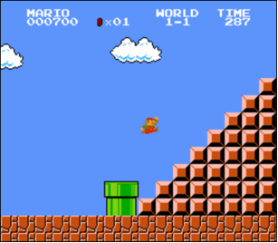

# c_14_mario

## DESCRIPTION

Toward the end of World 1-1 in Nintendo’s Super Mario Brothers, Mario must ascend right-aligned pyramid of blocks, a la the below.



Let’s recreate that pyramid in C, albeit in text, using hashes (#) for bricks, a la the below. Each hash is a bit taller than it is wide, so the pyramid itself will also be taller than it is wide.

```bash
       #
      ##
     ###
    ####
   #####
  ######
 #######
########
```

The program we’ll write will be called `mario`. And let’s allow the user to decide just how tall the pyramid should be by first prompting them for a positive integer between, say, 1 and 8, inclusive.

Here’s how the program might work if the user inputs `8` when prompted:

```bash
$ ./mario
Height: 8
       #
      ##
     ###
    ####
   #####
  ######
 #######
########
```

Here’s how the program might work if the user inputs `4` when prompted:

```bash
$ ./mario
Height: 4
   #
  ##
 ###
####
```

If the user doesn’t, in fact, input a positive integer between 1 and 8, inclusive, when prompted, the program should re-prompt the user until they cooperate:

```bash
$ ./mario
Height: -1
Height: 0
Height: 42
Height: 50
Height: 4
   #
  ##
 ###
####
```

## INSTALL LIBRARIES

The source code uses the cs50 library what you can download [HERE](https://github.com/cs50/libcs50).

To install the cs50 library follow the steps:

1. Open git bash terminal and change the current working directory to `src`:  
   > cd ./libsc50/src

2. Compile the cs50.c source into .o with:
   > gcc -c cs50.c -o cs50.o

3. Make the library archive:  
   > ar rcs libcs50.a cs50.o

4. Copy the `libcs50.a` file into your compiler's `lib` directory

5. Copy the `cs50.h` file into your compiler's `include` directory

## COMPILE AND RUN THE CODE

The code is written in C, the compiler used to generate the exe is: `gcc Rev10, Built by MSYS2 project 12.2.0`

Run the below code in terminal (git bash) to compile the source:

> gcc commandLineArgument.c -lcs50 -o ./build/commandLineArgument

To run the executable run the below code in terminal (git bash):

> ./build/commandLineArgument.exe
